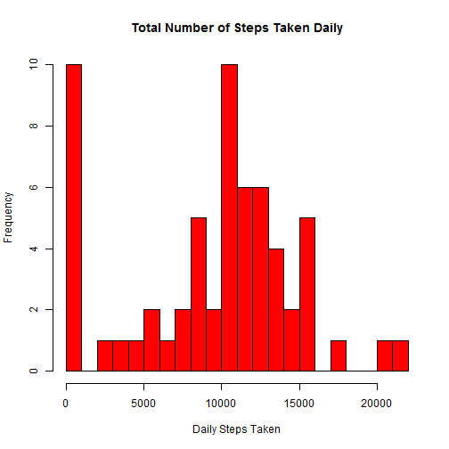
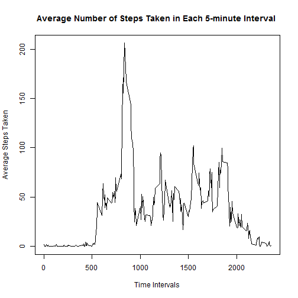
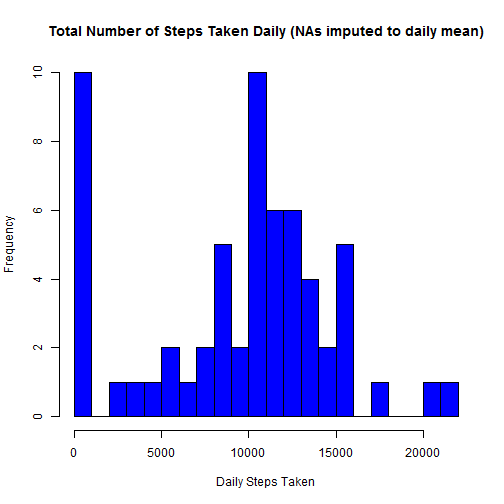
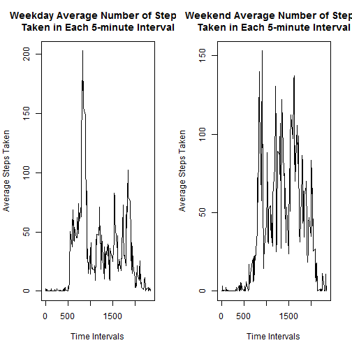

#Reproducible Research Project 1

The name of the source file is "PA1_template.Rmd".

The output file names are "PA1_template.md" a markdown file and "PA1_template.html" a HTML file.

##Introduction
This is an R Markdown document.  The output files can be built by running the "knit2html()" function (from the "knitr" package) from the console.

This analysis looks at data from a personal activity monitoring device.  

The data is found at <https://d396qusza40orc.cloudfront.net/repdata%2Fdata%2Factivity.zip>.


##Loading and preprocessing the data
The data file "activity.csv" needs to be unzipped and available in the working directory so that it is able to be read in for this analysis.

The "knitr" package will need to be loaded to process this R markdown document. The code in this section also loads the data file and process it into a format for use by this analysis.

The data file contains the number of steps recorded in during each 5-minute interval during each 24 hour period during October and November, 2012 for an anonymous individual.

The data file has three columns.  The first is named "step" and hold integer counts of the steps taken in a 5-minute interval.  There are missing step counts for a number of days and intervals and they have stored as "NA".

The second column is the "date" column and holds the date the steps were recorded.  The format is "YYYY-MM-DD".

The third and last column is named "interval".  This column holds the time interval the steps were recorded in on the date.  Time intervals are recorded as the time at the start of the interval. 

For example the first 5-minute interval afer midnight is recorded as "0".
The third 5-minute interval is recorded as "10".
The first 5-minute interval of the second hour is recorded as "100".
The fourth 5-minute interval of the fourth hour is recorded as "315".
The last 5-minute interval of the last hour of the day is recorded as "2355".


```r
try(library(dplyr), silent = TRUE)
try(library(stringr), silent = TRUE)
try(library(lubridate), silent = TRUE)
theColumnClasses <- c("integer", "character", "character")
csvDataFile <- "activity.csv"
if (!file.exists(csvDataFile)) 
    stop("File 'activity.csv' not in the working directory")
ActivityDf <- read.csv(csvDataFile, header = TRUE, sep = ",",
                        na.strings = "NA", colClasses = theColumnClasses, 
                        stringsAsFactors = FALSE)
ActivityDf$date <- as.Date(ActivityDf$date, "%Y-%m-%d")
ActivityDf$interval <- str_pad(ActivityDf$interval, 4, pad ="0")
```


##What does a histogram of total steps taken each day look like and what is the mean and median total number of steps taken per day?

The missing values in the dataset have been ignored.  

The data is grouped by date and the sum of the steps taken each day is calculated and displayed as a histogram.

A histogram of the total number of steps taken each day is plotted below.


```r
DateActivityDf <- group_by(ActivityDf, date)
DateStepCount <- summarise(DateActivityDf, 
                           StepCount = sum(steps, na.rm = TRUE))
hist(DateStepCount$StepCount, col = "red", 
     breaks = max(DateStepCount$StepCount)/1000, 
     main ="Total Number of Steps Taken Daily", xlab = "Daily Steps Taken")
```

 


The mean of the total number of steps taken each day is:


```r
MeanStepsDaily <- mean(DateStepCount$StepCount)
print(MeanStepsDaily)
```

```
## [1] 9354.23
```

The median of the total number of steps taken each day is:


```r
MedianStepsDaiy <- median(DateStepCount$StepCount)
print(MedianStepsDaiy)
```

```
## [1] 10395
```


##What is the average daily activity patern?
A time series is constructed of the 5-minute intervals along the x-axis.
The y-axis records the average number of steps taken in each interval averaged across all days in the data set.


```r
IntervalActivityDf <- group_by(ActivityDf, interval)
IntervalSteps <- summarise(IntervalActivityDf, 
                              IntervalMean = mean(steps, na.rm = TRUE))
plot(IntervalSteps$interval, IntervalSteps$IntervalMean, type = "l", 
     xlab = "Time Intervals", ylab = "Average Steps Taken", 
     main = "Average Number of Steps Taken in Each 5-minute Interval ")
```

 


The maximum mean number of steps taken, across all days of the data set, in any of the 5-minute intervals is:


```r
MaxMean <- max(IntervalSteps$IntervalMean)
print(MaxMean)
```

```
## [1] 206.1698
```


The 5-minute interval, which, on average across all days of the data set, contains the maximum number of steps is as below. 


```r
IntervalMaxMean <- IntervalSteps[which(IntervalSteps$IntervalMean == MaxMean), ]
print(IntervalMaxMean$interval)
```

```
## [1] "0835"
```


##Consider the effect of imputing missing values.
The total number of missing values in the data set is:


```r
print(sum(is.na(ActivityDf$steps)))
```

```
## [1] 2304
```


The missing values for a particular 5-minute interval are imputed to be the mean number of steps for that day.

If there is no mean able to be calculated for a day then the missing value is set to zero.

A new dataset is constructed with the  missing values filled in as above.


```r
DateStepMean <- summarise(DateActivityDf, StepMean = mean(steps, na.rm = TRUE))
DateStepMean$StepMean[is.na(DateStepMean$StepMean)] <- 0
ImpDateActivityDf <- merge(DateActivityDf, DateStepMean, by.x = "date", 
                           by.y = "date")
ImpDateActivityDf[is.na(ImpDateActivityDf$steps), "steps"] <- 
    ImpDateActivityDf[is.na(ImpDateActivityDf$steps), "StepMean"]
ImpDateActivityDf$StepMean <- NULL
ImpDateActivityDf <- group_by(ImpDateActivityDf, date)
ImpDateStepCount <- summarise(ImpDateActivityDf, StepCount = sum(steps))
```

From this new dataframe with imputed values for the missing steps a histogram is plotted of the total number of steps taken each day.


```r
hist(ImpDateStepCount$StepCount, col = "blue", 
     breaks = max(ImpDateStepCount$StepCount)/1000, 
     main ="Total Number of Steps Taken Daily (NAs imputed to daily mean)", 
     xlab = "Daily Steps Taken")
```

 

The mean of the total number of steps taken each day with imputed values is as below.


```r
ImpMeanStepsDaily <- mean(ImpDateStepCount$StepCount)
print(ImpMeanStepsDaily)
```

```
## [1] 9354.23
```

The median of the total number of steps taken each day with imputed values is as below.


```r
ImpMedianStepsDaiy <- median(ImpDateStepCount$StepCount)
print(ImpMedianStepsDaiy)
```

```
## [1] 10395
```


The mean and median values based upon the data set with imputed missing values can be compared to the mean and median values calculated earlier in this analysis where no imputation was made for missing values.

There is NO DIFFERENCE between the values of the mean and median obtained with and without imputation for missing values

The method used here to handle missing data has had NO EFFECT upon the mean and median values for the total daily number of steps.


##Do weekdays and weekends have differences in activity patterns?

The data frame used for this analysis is the data frame from above with imputed values for the missing step counts.

In order to answer that question a new factor variable in the dataset is defined with two levels "weekday" and "weekend".


```r
dayvalues <- c("weekend", rep("weekday", 5), "weekend")
ImpDateActivityDf$daytype <- dayvalues[wday(ImpDateActivityDf$date)]
weekdayfactor <- factor(ImpDateActivityDf$daytype)
```

A panel plot is constructed to compare the activity paterns.

The top panel is a time series plot of the average number of steps taken, averaged across all weekdays (y-axis), for each 5-minute interval (x-axis).

The bottom panel is a similar time series plot of the average number of steps taken, averaged across all weekend days (y-axis), for each 5-minute interval (x-axis).


```r
ImpIntervalActivityDf <- group_by(ImpDateActivityDf, daytype, interval)
ImpIntervalSteps <- summarise(ImpIntervalActivityDf,
                             DayIntervalMean = mean(steps))
weekdayIntervalDf <- subset(ImpIntervalSteps, daytype == "weekday")
weekendIntervalDf <- subset(ImpIntervalSteps, daytype == "weekend")
par(mfcol = c(1, 2))
plot(weekdayIntervalDf$interval, weekdayIntervalDf$DayIntervalMean, type = "l", 
     xlab = "Time Intervals", ylab = "Average Steps Taken", 
     main = "Weekday Average Number of Steps \nTaken in Each 5-minute Interval")
plot(weekendIntervalDf$interval, weekendIntervalDf$DayIntervalMean, type = "l", 
     xlab = "Time Intervals", ylab = "Average Steps Taken", 
     main = "Weekend Average Number of Steps \nTaken in Each 5-minute Interval")
```

 

Activity levels are higher on the weekend compared to weekdays.


